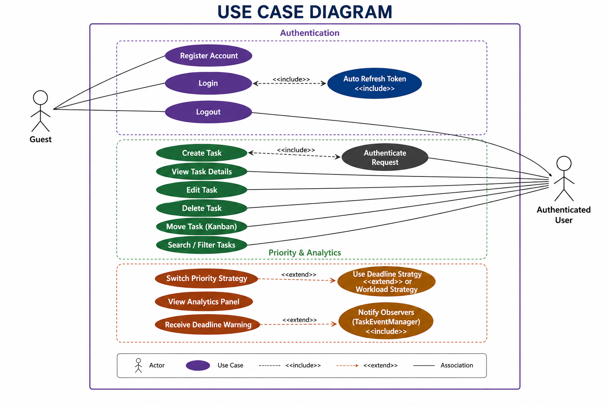
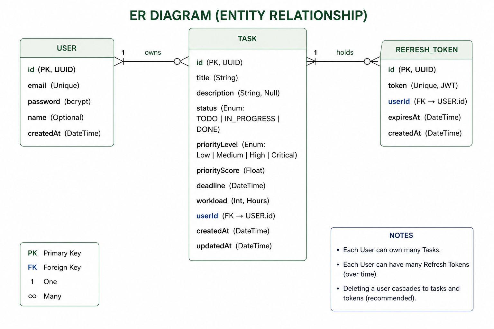
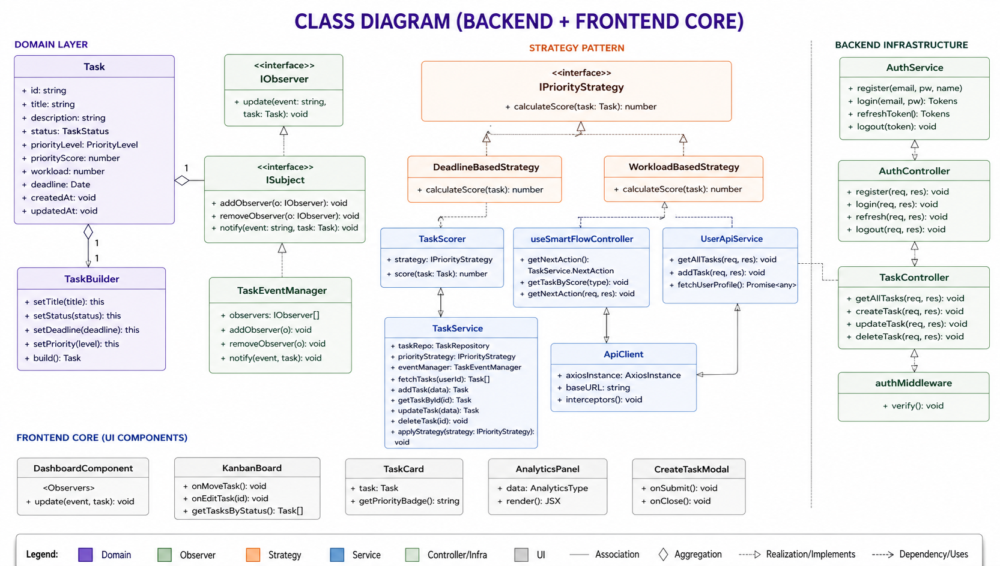
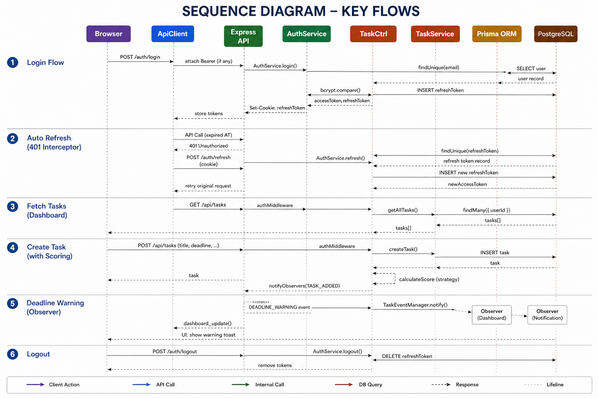

# System Design Diagrams

This folder contains all architecture and design diagrams used in the **System Design Capstone** project.

---

## 1. Use Case Diagram

### Description
Represents the interactions between users/admins and the Task Management System.

### Actors
- **User**
  - Login / Registration
  - Create & Update Tasks
  - Calculate Task Priority
  - Receive Notifications

- **System Admin**
  - Manage User Accounts
  - View Task Analytics
  - Access Reports

---

## 2. Entity Relationship Diagram (ER Diagram)

### Description
Defines the database schema and relationships between entities.

### Entities
#### User
- id (UUID, PK)
- email (Unique)
- password
- name
- createdAt

#### Task
- id (UUID, PK)
- title
- description
- status
- priorityLevel
- priorityScore
- deadline
- workload
- userId (FK)
- createdAt
- updatedAt

#### Refresh Token
- id (UUID, PK)
- token (Unique)
- userId (FK)
- expiresAt
- createdAt

---

## 3. Class Diagram

### Description
Illustrates the object-oriented design and design patterns used in the system.

### Major Components
- **Auth Layer**
  - AuthService
  - AuthController
  - AuthError

- **Task Layer**
  - TaskController
  - TaskService
  - TaskBuilder
  - TaskModel

- **Priority Strategy Pattern**
  - IPriorityStrategy
  - WorkloadBasedStrategy
  - DeadlineBasedStrategy

- **Observer Pattern**
  - ISubject
  - TaskEventManager
  - IObserver

---

## 4. Sequence Diagram

### Description
Shows interaction flow between system components during major operations.

### Covered Flows
1. Task Creation Flow  
2. Authentication/Login Flow  
3. Task Status Update Notification Flow  
4. Cached Task Retrieval Flow  

---

## Diagram Summary

These diagrams collectively describe:

- Functional Requirements
- Database Design
- Object-Oriented Architecture
- Runtime Interactions
- Applied Design Patterns
- Scalability Considerations

---

## Notes

All diagrams were created for the **System Design Capstone** and represent the architecture/design decisions of the project.